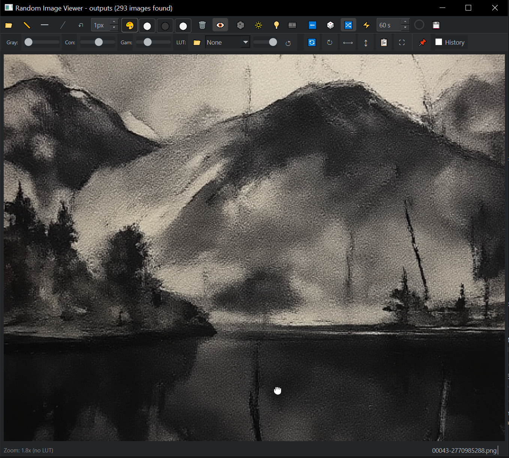

# Ova Viewer

A fast, feature-rich media viewer for Windows built with PySide6. View images, PDFs, EPUBs, comic archives (CBR/CBZ), animated GIFs, and videos in a single window — with a full annotation layer and non-destructive image enhancement stack.

---

## Recent Updates

- Added an eraser tool that removes annotations without touching the underlying image.
- Added live free-line preview while placing 2-click line annotations.
- Added posterize/value-filter controls for reducing images to N grayscale tones.
- Added Canny-based edge detection with OpenCV support and adjustable sensitivity.
- Added Object Groups — a cryptomatte-style pass that splits the image into objects and flattens each to its own local color.

## Features

**Viewing**
- 📁 Open any folder (including subfolders) via button or drag & drop
- 🖼️ Images · 📄 PDFs (single / 2-page / 3-page book spread) · 📚 EPUBs · 🗜️ CBR/CBZ comics · 🎞️ Animated GIFs · 🎬 Videos
- 🔍 Zoom & pan (mouse wheel + right-click drag)
- 🔄 Rotate, flip horizontal/vertical
- 🖥️ Fullscreen (F11) and minimal/frameless mode
- 🕒 Auto-advance timer with circular countdown overlay
- ⏮️ History navigation (back/forward through viewed images)
- 🔀 Random or alphabetical sorting

**Annotation**
- 📏 Vertical, horizontal, and free-angle line tools
- 🧽 Eraser tool for removing parts of line and free-draw annotations
- ✏️ Freehand draw with pressure-sensitive thickness (pen/stylus/tablet)
- 👀 Live rubber-band preview for free-angle line placement
- Undo, toggle visibility, clear all lines
- Save annotated view to file

**Color & Enhancement**
- 💉 **Color Snap eyedropper** — hover to preview, click to pick a color from the image
- 🪄 **Auto-extract palette** — extracts dominant colors into the floating palette panel
- 🎨 **Floating palette panel** — resizable, draggable, persists across tool switches; swatches organized by extraction session
- 🎞️ **CUBE LUT support** with GPU-accelerated (OpenCL) processing and adjustable strength
- ◑ **Posterize/value filter** — reduce images to 2-10 grayscale tones for value studies
- 🎨 **Color Groups** — reduce the whole image to N flat colors sampled from itself
- 🧩 **Object Groups** — cryptomatte-style: segments the image into objects and flattens each to its *own* local color, so two objects sharing a color stay separate. Local colors, local colors + outlines, or random ID colors; adjustable detail and minimum object size
- 📐 **Edge detection** with Canny filtering and multiple display modes
- Grayscale, contrast, and gamma sliders with per-effect toggles

**Other**
- 🎨 Adaptive dark/light theme (follows Windows system setting)
- ⌨️ Full keyboard shortcut set (see [SHORTCUTS.md](SHORTCUTS.md))
- Copy current image to clipboard (📋)

---

## Installation

```sh
git clone https://github.com/designOVAcz/ova-viewer.git
cd ova-viewer
pip install -r requirements.txt
# Optional GPU LUT acceleration:
# pip install pyopencl
# If installing dependencies manually, include opencv-python for edge detection.
python main.py
```

---

## Usage

1. Drag a folder into the app or click 📁 to open one
2. Navigate with **← →** or enable the auto-advance timer (**⚡**)
3. Annotate with the line/draw tools in the toolbar
4. Toggle **💉** to pick colors from the image; use **🪄** to auto-extract a palette
5. Load a `.cube` LUT file and adjust strength with the slider
6. Press **F11** for fullscreen, **Esc** to exit

---

## Build a Standalone Executable

```sh
pip install pyinstaller
pyinstaller "Ova Viewer.spec"
# Output: dist/Ova Viewer.exe
```

---

## Screenshot



---

## License

MIT License.

